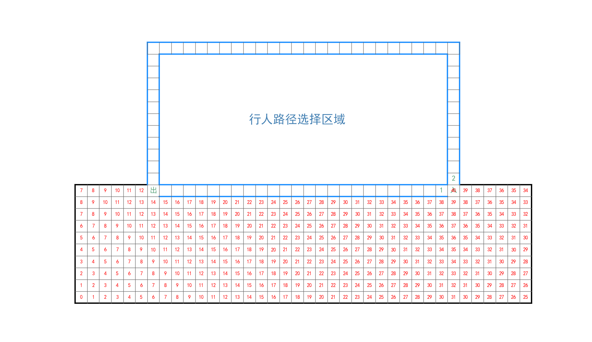
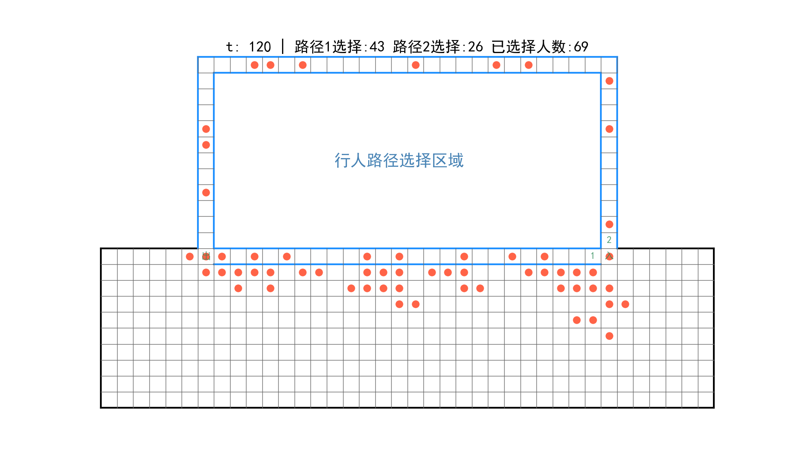

## 概述

利用“双层模型1+串行更新”在规定的模拟空间中实现行人路径选择。

# Peds Choice Model(peds_choice1.py)

## 运行

```
python peds_choice1.py 
```
## 参数介绍

|      参数       |         描述           |                              修改位置                           |
|-----------------|------------------------|-----------------------------------------------------------------|
|   MAX_STEPS     |总模拟时间步长          |第39行，默认120s                                                 |
|   npeds         |模拟总人数              |第27行，默认60人                                                 |
|   ks            |静态场域灵敏度参数      |第29行，默认1.5                                                  |
|   kd            |动态场域灵敏度参数      |第31行，默认0                                                    |
|   kL            |路径长度灵敏度参数      |第33行，默认1.5，越大表示行人更愿意选择路程短的路径              |
|   kj            |路径拥堵灵敏度参数      |第35行，默认8，越大表示行人更不愿意选择拥堵的路径                |
|   kg            |路径跟随灵敏度参数      |第37行，默认1，越大表示行人跟随上一个人的选择的意愿更强烈        |
|   image_time    |生成行人图片的时间间隔  |第41行，默认10                                                   |
|   ACC           |路径内部是否可以加速移动|第43行，默认0。0表示不可以加速，1表示可以加速                    |

## 模拟结果
- 静态场域图

- 行人图像


## 文件

- [peds_images]() 行人每个时刻的具体位置的图片
- [peds_video]()  整个模拟的视频
- [simulation]()  利用默认值已生成完成的行人视频和图片
- [SFF.png](SFF.png)     静态场域值图片
- [space.png](space.png)   模拟区域图片

## 参考文献

Cellular Automaton. Floor Field Model [Burstedde2001] Simulation of
pedestriandynamics using a two-dimensional cellular automaton Physica A, 295,
507-525, 2001

 


 
