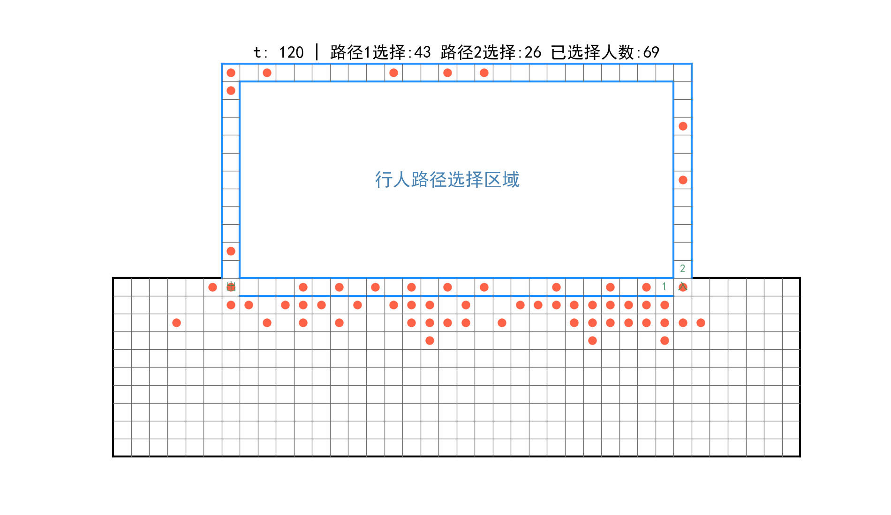

## 概述

利用“双层模型2+串行更新”在规定的模拟空间中实现行人路径选择。

# Peds Choice Model(peds_choice2.py)

## 运行

```
python peds_choice2.py 
```
## 参数介绍

|       参数      |                      描述                     |                         修改位置                       |
|-----------------|-----------------------------------------------|--------------------------------------------------------|
|   npeds         |模拟总人数                                     |第27行，默认60人                                        |
|   ks            |静态场域灵敏度参数                             |第29行，默认1.5                                         |
|   kd            |动态场域灵敏度参数                             |第31行，默认0                                           |
|   kL            |行人初始决策：路径长度灵敏度参数               |第34行，默认1.6，越大表示行人更愿意选择路程短的路径     |
|   kn            |行人初始决策：流入路径人数灵敏度参数           |第35行，默认0.5，越大表示行人更不愿意选择人多的路径     |   
|   kj            |行人初始决策：路径排队长度灵敏度参数           |第36行，默认0.6，越大表示行人不愿意选择排队队列长的路径 |
|   a             |行人更改决策：惯性灵敏度参数                   |第39行，默认1.0，越大表示行人更不愿意改变当初始选择     |
|   G             |行人更改决策：行人不改变选择的惯性值           |第40行，默认1.8，越大表示行人更不愿意改变初始选择       |
|   b             |行人更改决策：另一条路径行人积极性参数         |第41行，默认0.3，越大表示行人不愿意选择人更多的路径     |
|   c             |行人更改决策：另一条路径相对排队长度灵敏度参数 |第42行，默认0.5，越大表示行人不愿意排队队列更长的路径   |
|   MAX_STEPS     |总模拟时间步长                                 |第45行，默认120s                                        |
|   image_time    |生成行人图片的时间间隔                         |第47行，默认10                                          |
|   ACC           |路径内部是否可以加速移动                       |第49行，默认0。0表示不可以加速，1表示可以加速           |

## 模拟结果
- 行人图像


## 文件

- [peds_images]() 行人每个时刻的具体位置的图片
- [peds_video]()  整个模拟的视频
- [simulation]()  利用默认值生成的行人视频和图片
- [SFF.png](SFF.png)     静态场域值图片
- [space](space.png)   模拟区域图片

## 参考文献

Cellular Automaton. Floor Field Model [Burstedde2001] Simulation of
pedestriandynamics using a two-dimensional cellular automaton Physica A, 295,
507-525, 2001
 


 
