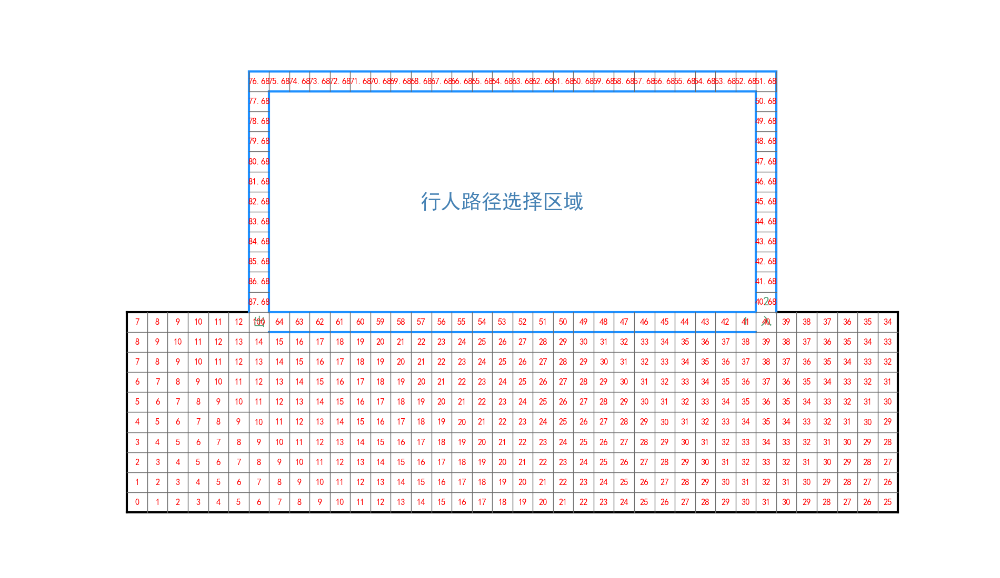
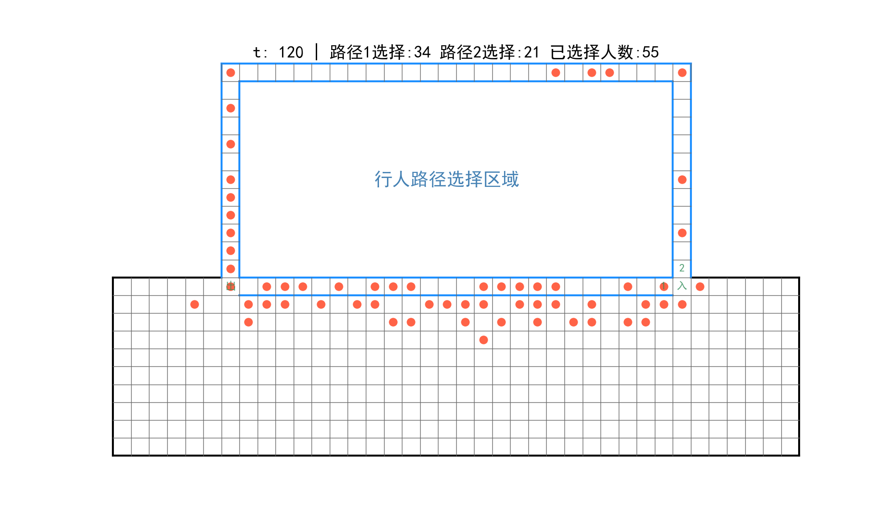

## 概述

利用“单层模型（静态场域）+并行更新”在规定的模拟空间中实现行人路径选择。

# Peds Choice Model(peds_choice01.py)

## 运行

```
python peds_choice01.py 
```
## 参数介绍

|      参数       |         描述           |                              修改位置                           |
|-----------------|------------------------|-----------------------------------------------------------------|
|   MAX_STEPS     |总模拟时间步长          |第33行，默认120s                                                 |
|   npeds         |模拟总人数              |第31行，默认60人                                                 |
|   ks            |静态场域灵敏度参数      |第27行，默认1.5                                                  |
|   kd            |动态场域灵敏度参数      |第29行，默认0                                                    |
|   rc1           |路径1静态场域值         |第36行，默认41，不建议修改                                       |
|   rc2           |路径2静态场域值         |第38行，默认40.68，越大则路径2选择的概率越大，取值范围：(40,41]  |
|   image_time    |生成行人图片的时间间隔  |第40行，默认10                                                   |

## 文件

- [peds_images]() 行人每个时刻的具体位置的图片
- [peds_video]()  整个模拟的视频
- [simulation]()  利用默认值完成的行人视频和图片
- [SFF.png](SFF.png)     静态场域值图片

## 模拟结果
- 静态场域图

- 行人图像


## 参考文献

Cellular Automaton. Floor Field Model [Burstedde2001] Simulation of
pedestriandynamics using a two-dimensional cellular automaton Physica A, 295,
507-525, 2001

 
